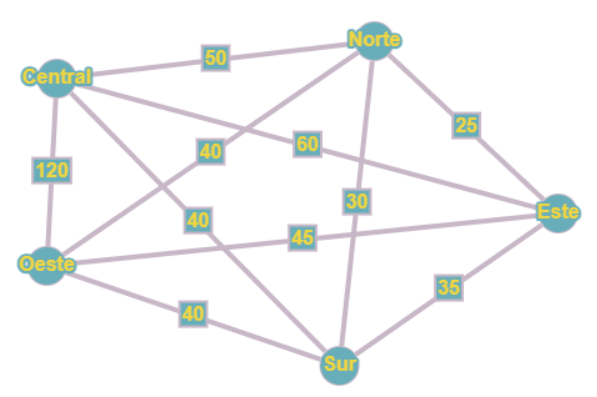
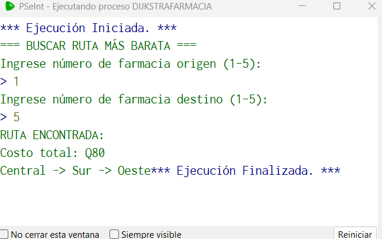
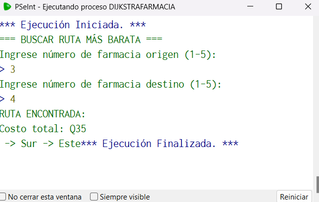
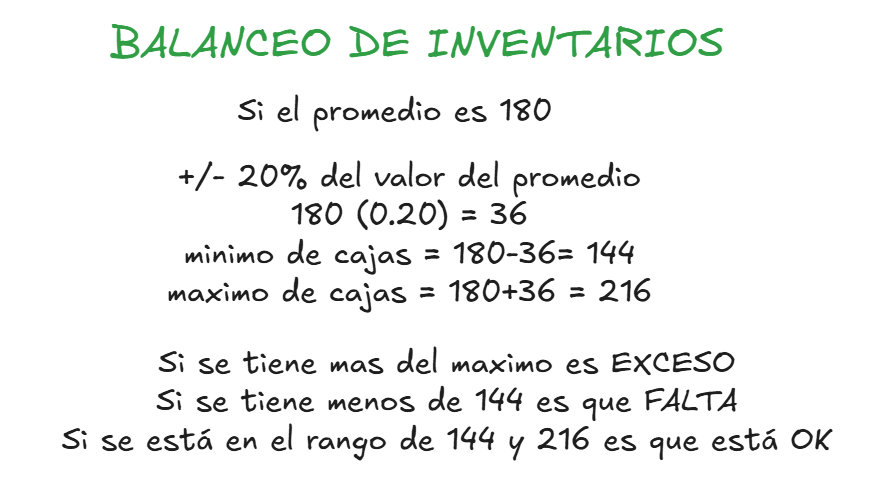
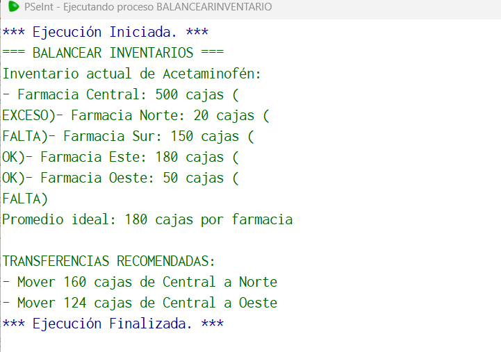
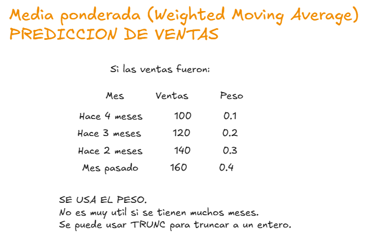
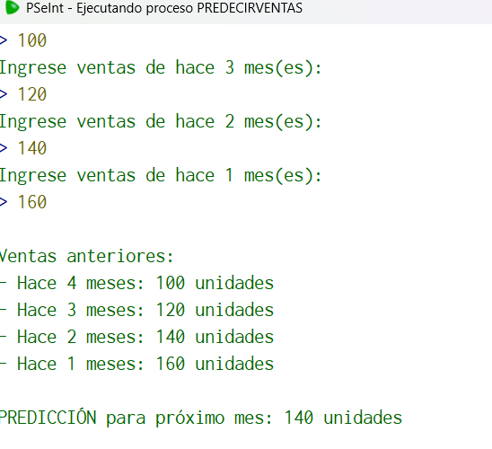
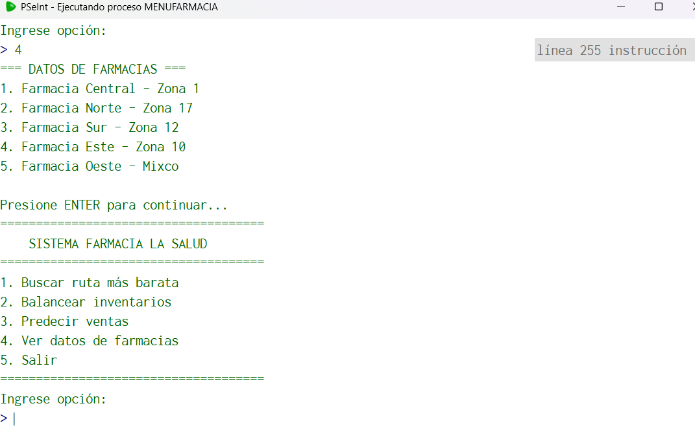

###  
 Solucion Proyecto 1 Algoritmos 

###  
 Sistema Farmaceutico 

___

### 1. Algoritmo de Dijkstra

El algoritmo de la ruta más corta. Se toma en cuenta la tabla de pesos que serán para las aristas, estos pesos se pueden llegar a simular en el pseudocódigo como si fuese una matriz. Digamos son 5 nodos, simular entonces una matriz 5*5.

**Uso de PSeInt**

### 2. Balanceo de Inventarios

El balanceo de inventarios, es necesario tomar en cuenta la cantidad de cajas que tendrá cada sucursal de farmacia por medicamento, y tomando el valor del promedio de cajas dentro de las sucursales, del mismo medicamento. Se podrá hacer el balanceo de inventario, para optimizar los recursos dentro de las disintas sucursales.

**Uso de PSeInt**

### 3. Prediccion de Ventas

La predicción de ventas, se basa en una formula sencilla y se utiliza como una media ponderada, para obtener una predicción de ventas de un medicamento en el proximo mes, con base a las ventas de los últimos 4 meses.

**Uso de PSeInt**

____

### Menu Principal

Se desarrolla un menú principal, que abarca la resolución de los problemas de la farmacia.

