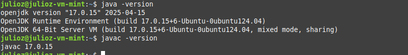

###  <div align="center"> Solucion Proyecto 2 Algoritmos </div>
###  <div align="center"> Implementación VM - Tienda USAC </div>
___

###  <div align="center"> Oracle Virtual Box y Linux Mint </div>

Se utilizó VirtualBox 7.0 y se utilizó la distribución de **Linux Mint** para poder trabajar el proyecto.

Instalar Imagen ISO de Linux Mint:
Dirigirse a https://www.linuxmint.com/edition.php?id=316, y poder instalar la imagen del sistema operativo para poder montarlo en Virtual Box y poder crear la VM.

Crear VM e inicializar Linux Mint:
Configurar todo lo que se nos sea util para utilizar Linux Mint, como copiado bidireccional entre máquina host y la VM, los Guest Additions etc.

___

####  <div align="center"> Instalacion de JDK 17 en Linux Mint </div>

Utilizar los siguientes comandos dentro de la consola de Linux Mint, para poder instalar OpenJDK 17 desde repositorios oficiales.


1. Actualizar los repositorios

```bash
sudo apt update
```

2. Instalar OpenJDK 17

```bash
sudo apt install openjdk-17-jdk
```


3. Verificar que Java se haya instalado


```bash
java -version
```

4. Verificar que el compilador de Java también esté instalado

```bash
javac -version
```



______

####  <div align="center"> Explicación Sistema Inventario en Java </div>
